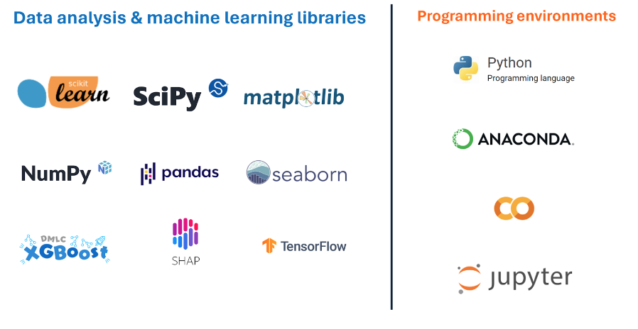

# SaturdaysAI (Asturias) ML project (Machine Learning on a Brain Metastases Study)

  

# Content
- [Team](https://github.com/aguadotzn/SaturdaysAI#Team)
- [Introduction](https://github.com/aguadotzn/SaturdaysAI#Introduction)
- [Objectives](https://github.com/aguadotzn/SaturdaysAI#Objectives)
- [Data](https://github.com/aguadotzn/SaturdaysAI#Data)
- [Technologies/Tools](https://github.com/aguadotzn/SaturdaysAI#Technologies)
- [Acknowledgements](https://github.com/aguadotzn/SaturdaysAI#Acknowledgements)

## Team
- [Arturo Linares](https://github.com/afouteza) - _arturo.linares@merkle.com_
- [Mateo Rodríguez](http://www.linkedin.com/in/mateo-r-6az) - _mateorsuarez@gmail.com_
- [Olumayowa Onabanjo](https://www.linkedin.com/in/olumayowa-onabanjo-452b8143) - _UO298003@uniovi.es_
- [Raquel Martínez](https://www.linkedin.com/in/rakelmarmar/) - _martinezmraquel@uniovi.es_
- [Adrián Aguado](https://www.aguadotzn.com) - _aagfront@gmail.com_

  

  

## Introduction
Cancer has life changing implications and brain metastases are currently one of the hardest to treat. But there is hope, early detection and effective treatment go a long way to ensure patients have the best odds against the disease. 

Brain metastases are cancer cells that spread to the brain from tumors in other organs in the body, which happens in 10% – 35% of adult cancer patients. Estimating prognosis in brain metastasis is clinically relevant, as it allows clinicians to recommend treatments that balance durability of intracranial tumor control with quality of life and side effects of treatment.  In this project we try to make an experiment with machine learning that operates with the [MOLAB](https://molab.es/mathematics-and-brain-metastasis/?idtema=171) data.

## Objectives
One of our goals was to accurately predict how much time is left to savor life. The second goal is just as important, determining when a person is likely to relapse. We’ll run you through our dataset, how we explored the data, decided on an appropriate Machine Learning (ML) approach and our results. We hope this summary helps anyone interested in this dataset and we look forward to your feedback and comments.

  

## Data

We worked on the [MOLAB Brain Metastasis Dataset](https://molab.es/datasets-brain-metastasis-1/), a structured and anonymized dataset covering segmented Magnetic Resonance Imaging (MRI) scans, clinical data and morphological measurements of 75 patients.

There are 3 groups of files with structured and unstructured data. You have all the data inside _/data_ folder
- **Clinical data**: an excel spreadsheet with patient data and treatment history.
- **Morphological measures**: an excel file with tumor dimensions and MRI info.
- The **MRI scans** are in formats such as nifti and DICOM.

You can find the main data source here: [MOLAB Brain Metastasis Dataset](https://molab.es/datasets-brain-metastasis-1/?type=metasrd).

## Conclusions
We divide our work into:
- Predicting patient relapse - Obtain predictive variables to estimate the recurrence.
- Survival - An estimate of the number of days (and possible cause) a patient has left.

// TODO

## Technologies
  * [Python](https://en.wikipedia.org/wiki/Python_(programming_language))
  * [Google Colab](https://colab.google/)
  
* Libraries
  * [Pandas](https://pandas.pydata.org/)
  * [Seaborn](https://seaborn.pydata.org/)
  * [Matplotlib](https://matplotlib.org/)
  * [NumPy](https://numpy.org/)
  * [Scipy](https://scipy.org/)

  

## Acknowledgements 
Thanks to all the SaturdaysAI team for pushing us during these 16 weeks (from February 2024 to June 2024). Thanks also to [MOLAB](https://molab.es/) (Mathematical Oncology Laboratory) for the fantastic work they are doing.

## License

This project is licensed under the GNU License - see the [LICENSE](LICENSE) file for details.
Copyright (c) 2024 Adrián.

